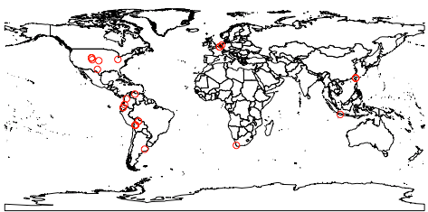
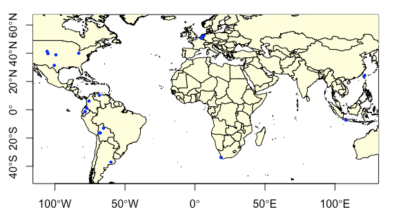
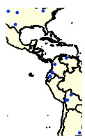
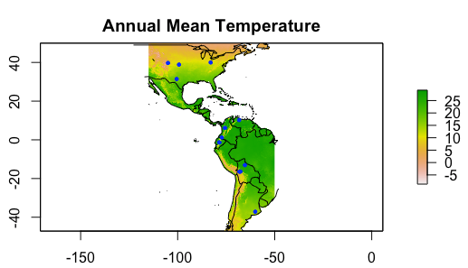
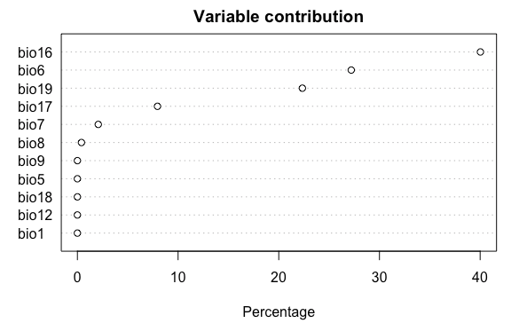
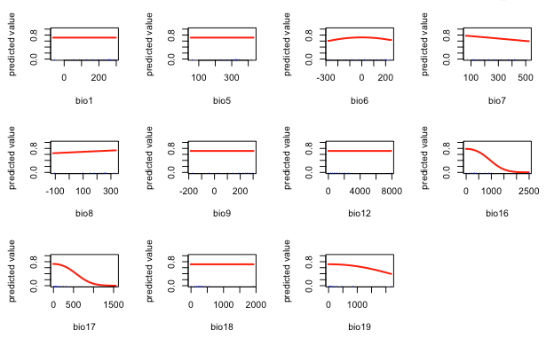
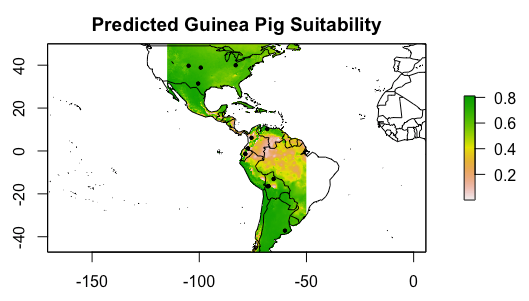
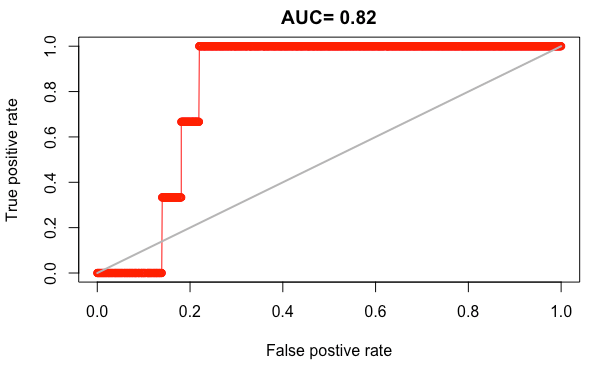
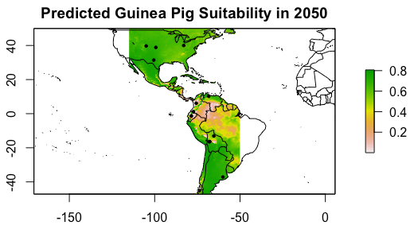
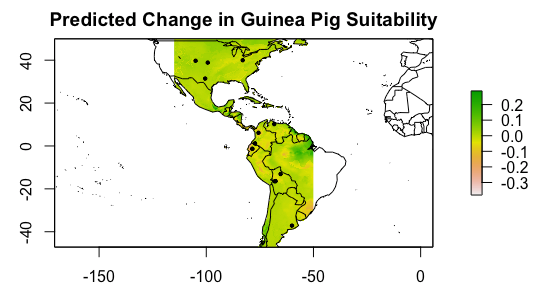

# **Guinea Pig SDM**

## Author: Shannon Reault

Date: 11/24/2020

R Studio: 1.1.463

---

This tutorial teaches the user how to create a Species Distribution Model in R Studio. Species distribution models are tools that combine observations of species occurences with environmental variables to predict suitable habitat rannge (Elith & Leathwick 2009). The application and complexity of SDMs varies based on selected variables, scale, and extrapolation (Elith & Leathwick 2009). For the pyrposes of this R Studio tutorial, our model will be fairly simple. R Studio is a good resource for constructing SDMs, as the dismo package allows for ghe use of open source climate data to determine the environment favorable for a given species (Yoder 2013). This methodology can be used for any species- I demonstrate the workflow for guinea pig species distribution. This tutorial is based on techniques presented in the following resources:\
https://www.rpubs.com/kerkhoffa/SDMMaxent

https://www.youtube.com/watch?v=1C1zVJO-Rk0&t=232s

This tutorial utilizes the maxent package, which can be downloaded here from the site below. This model uses environmental grids and occurrence data to portray a probability distribution of suitability for the chosen species (Phillips 2020). In this tutorial, maxent is utilized to predict habitat suitability in a current scenario, as well as a future scenario (2070).
https://biodiversityinformatics.amnh.org/open_source/maxent/ \


Make sure that the maxent.jar file is in the java folder within the dismo package folder. My file was not in that folder, and when I tried to run maxent, I recived an error that said the file was missing. If this happens, follow the file path in the error and place maxent.jar there. 

Before we begin, identify your source for species occurence data. I downloaded species occurrence data from the Global Biodiversity Information Facility. I highly recommend this resource, which provides over 50,000 biodiversity datasets for free download. Use the link below to see if GBIF has occurrence data for your species:/
https://www.gbif.org/

Ok, let's get started!

First, load the necessary libraries:
```{r}
library(rgeos)
library(raster)
library(rgdal)
library(dismo)
library(maptools)
library(maps)
library(mapdata)
library(rJava)
library(jsonlite)
```
Now, import the species occurrence data. This should be data that can easily be used to genreate points (has lititude, longitude coordinates). I downloaded my guinea pig occurrences from https://www.gbif.org/. Then, I imported them to my global enviroment by navigating to "import dataset" under environment. I was working with this data in another script, so I saved it as an Rdata file to easily load it into my markdown file:
```{r, echo = T}
guinea_points = readRDS(file = "occurrences.rds")
```
Let's see what our point data looks like. We will plot it usign the "wrld_simp" map provided by rgeos. 
```{r, echo=TRUE}
data("wrld_simpl") #get border data from rgeos
plot(wrld_simpl) #plot the border
points(guinea_points$decimalLongitude, guinea_points$decimalLatitude, col = "red") #plot the points
```


It looks good, but we need to make sure all the points are valid. First, we will exclude any observations without lat/long data:

```{r pressure, echo=T}
guinea_points = subset(guinea_points, !is.na(decimalLongitude) & !is.na(decimalLatitude)) # specifying to only include data where lat/long values are not (!) NA
```
Now, we will remove any duplicate points:
```{r, echo=T}
GPdups = duplicated(guinea_points[c("decimalLatitude", "decimalLongitude")])
guinea_points<-guinea_points[!GPdups, ] #without (!) DPdups
```
Ok, now let's take another look at the data:
```{r, echo=TRUE}
plot(wrld_simpl, xlim = c(min(guinea_points$decimalLongitude)-1, max(guinea_points$decimalLongitude)+1), ylim = c(min(guinea_points$decimalLatitude)-1, max(guinea_points$decimalLatitude)+1), axes = T, col = "light yellow")
points(guinea_points$decimalLongitude, guinea_points$decimalLatitude, col = "blue", pch = 20, cex=.75)
```


Most wild guinea pig populations are located in South America, however there are not enough obserations in that region for our analysis. Therefore, our study area will include South America and the United States:
```{r, echo=T}
guinea_points<- guinea_points[guinea_points$decimalLongitude > -135 & guinea_points$decimalLongitude< -50 & guinea_points$decimalLatitude> -60 & guinea_points$decimalLatitude< 40, ]
```
Let's take a look at the species observations in South America with a higher resolution map from the map library:
```{r, echo=T}
map('worldHires', xlim = c(min(guinea_points$decimalLongitude)-1, max(guinea_points$decimalLongitude)+1), ylim = c(min(guinea_points$decimalLatitude)-1, max(guinea_points$decimalLatitude)+1), fill = T, col = "light yellow")
points(guinea_points$decimalLongitude, guinea_points$decimalLatitude, col = "blue", pch = 20, cex=.75)
```


We will specify the extent of our study area later, but before we do that, let's get the climate data from the Worldclim project (http://worldclim.org, Hijmans et al. 2005). This data will provide our bioclimatic variables:
```{r, echo=T}
#download using getData() from raster package
currentEnv=getData("worldclim", var="bio", res=2.5) #current scenario data
#get future climate prediction data: RCP 8.5, predictions for 2050
futureEnv=getData('CMIP5', var='bio', res=2.5, rcp=85, model='HE', year=50)
names(futureEnv)=names(currentEnv) #same names
```
Many environmental variables are included in this dataset. We will use the following:

BIO1 = Annual Mean Temperature\
BIO5 = Max Temperature of Warmest Month\
BIO6 = Min Temperature of Coldest Month\
BIO7 = Temperature Annual Range (BIO5-BIO6)\
BIO8 = Mean Temperature of Wettest Quarter\
BIO9 = Mean Temperature of Driest Quarter\
BIO12 = Annual Precipitation\
BIO16 = Precipitation of Wettest Quarter\
BIO17 = Precipitation of Driest Quarter\
BIO18 = Precipitation of Warmest Quarter\
BIO19 = Precipitation of Coldest Quarter

Therefore, we must specify which variables to exclude from the analysis:
```{r, echo=T}
currentEnv=dropLayer(currentEnv, c("bio2", "bio3", "bio4", "bio10", "bio11", "bio13", "bio14", "bio15")) #drop layers from current scenario
futureEnv=dropLayer(futureEnv, c("bio2", "bio3", "bio4", "bio10", "bio11", "bio13", "bio14", "bio15")) #drop layers from future scenario
```
Now, we have to define a suitable range for guinea pigs. For the purposes of this simple SDM, we define a 10-degree buffer around each of these ranges. We will also clip the climate rasters to this extent. 
```{r, echo=T}
#define the extent based in guinea points +/- 10 degrees
model.extent<-extent(min(guinea_points$decimalLongitude)-10,max(guinea_points$decimalLongitude)+10,min(guinea_points$decimalLatitude)-10,max(guinea_points$decimalLatitude)+10)
modelEnv=crop(currentEnv,model.extent) #crop the current raster
modelFutureEnv=crop(futureEnv, model.extent) #crop the future raster
```

To get an idea of what the climate variables look like in this range, let's plot the annual mean temperature with species observations:
```{r, echo=T}
plot(modelEnv[["bio1"]]/10, main="Annual Mean Temperature")
map('worldHires', ylim = c(min(guinea_points$decimalLatitude)-10,max(guinea_points$decimalLatitude)+10), xlim = c(min(guinea_points$decimalLongitude)-10,max(guinea_points$decimalLongitude)+10), fill = F, add = T)
points(guinea_points$decimalLongitude, guinea_points$decimalLatitude, col = "blue", pch = 20, cex=.75)
```


Before constructig the SDM, we need to assess how well the model predicts where wild guinea pigs would be found using cross-validation. We will use some of our species occurrences to test the model (20%), and the others to construct it (80%, training data):
```{r, echo=T}
#first we need to put the occurrence data in a dataframe
guinea_lat = list(guinea_points$decimalLatitude) #create lat list
guinea_long = list(guinea_points$decimalLongitude) #create long list
guinea_df = data.frame(unlist(guinea_long), unlist(guinea_lat)) #combine into a dataframe
names(guinea_df)<- c('lon', 'lat') #column names in dataframe
#now create test and training data
fold<- kfold(guinea_df, k = 5) # seperate the data into groups of 5
guinea_test<- guinea_df[fold == 1, ]# 1/5th for test data
guinea_training <-guinea_df[fold != 1, ] #other fifths training data
```
Now, we will fit the SDM using Maximum Entropy (Maxent) algorithm, which aims to identify the combination of variables that best predict guinea pig occurrences. 
```{r, echo=T}
guinea_df.me<- maxent(modelEnv, guinea_training) #using training data
```
We can plot this to relative improtance of climatic predictors:
```{r, echo=T}
plot(guinea_df.me)
```


Based on this plot, we can see that the model responds the most to variation in:

Bio 16: Precipitation of Wettest Quarter\
Bio6- Minumum Temperature of the Coldest Month\
Bio19- Precipitation of Coldest Quarter\
Bio 17: Precipitation of Driest Quarter

How does the likelihood of species occurrence respond to variation in these climatic conditions?
We can look at the shape of the response curves from the model with the response() function.
```{r, echo=T}
response(guinea_df.me)
```


In these plots, a flat line represents no response to change in a variable, an increasing line represents a positive response, and a decreasing line represents a negative response. 

Bio 16 (Precipitation of Wettest Quarter): Species are more likely to occur when there is low precipitation in the wettest quarter of the year.\
Bio6 (Minumum Temperature of the Coldest Month): Species occurrences increase very slightly when temperatures are mid-range in cold months.\
Bio19 (Precipitation of Coldest Quarter): Species occurrences decrease with more precipitation in the coldest quarter of the year.\
Bio 17 (Precipitation of Driest Quarter): Species are more likely to occur when there is the lowest possibile precipitation in the driest quarter of the year.

To see how model predicts the distribution of favorable habitat we have to generate predicted values for the cells in our region:
```{r, echo=T}
guinea.pred<- predict(guinea_df.me, modelEnv)
```
Now we can map the predicted favorable habitat with the original observations:
```{r, echo=T}
plot(guinea.pred, main = "Predicted Guinea Pig Suitability")
map('worldHires', fill = F, add = T)
points(guinea_points$decimalLongitude, guinea_points$decimalLatitude, pch = 20, cex =.7)
```


Habitat is predicted to be suitable where species occurrences are, which makes sense because these data points were used to fit the model. 

Now we have to evaluate the predictive accuracy of the model in order to see how well it actually does. We will use the Area Under the Receiver Operator Curve (AUC), which sets thresholds on the prediction to generate difference levels of false-positive rates, and then assesses the true positve rate as a function of the false-positive rate. We adapt the AUC method to work with presence only data by generating pseudoabsences from random points in the region of interest. 
```{r, echo=T}
ps_abs<- randomPoints(modelEnv, 1000)#generate pseudoabsences
#use evaluate to run several diagnostics, including AUC, using the test points as presence data
eval1<- evaluate(guinea_df.me, p = guinea_test, a = ps_abs, x = modelEnv)
plot(eval1, 'ROC')
```


On this plot, the 1:1 line represents AUC= 0.5, which would be randsom guessing. Therefore, our model does better than a random guess, but we must still analyze these results with caution becuase we are not using real absence data. 

Now that we have validated the model, we can use it to project how potential habitat could shift under climate change conditions. We will use the 2050 climate estimates based on RCP 8.5
```{r, echo=T}
guinea.2050 = predict(guinea_df.me, modelFutureEnv)
#map predicted values with observations
plot(guinea.2050, main = 'Predicted Guinea Pig Suitability in 2050')
map('worldHires', fill = F, add = T)
points(guinea_points$decimalLongitude, guinea_points$decimalLatitude, pch = 20, cex =.7)
```


Next, we can analyze the difference between the current suitable habitat and future suitable habitat scenarios:
```{r, echo=T}
guinea.change = guinea.2050 - guinea.pred #
plot(guinea.change, main = "Predicted Change in Guinea Pig Suitability")
map('worldHires', fill = F, add = T)
points(guinea_points$decimalLongitude, guinea_points$decimalLatitude, pch = 20, cex =.7)
```


In this map, values above zero indicate an increase is habitat suitability, and values belw zero indicate a decrease in habitat suitability. Therefore, our study area presents a decent amount of increasing suitability for guinea pigs, with smaller regions of slight decrease. 

And that's all! I hope you enjoyed this tutorial :)


Sources:

Elith, J. & Leathwick, J. "Species Distribution Models: Ecological Explanation ad Prediction Across Space and Time" *Annual Review of Ecology, Evolution, and Systematics*, vol. 40, pp. 677-697. 2009. https://doi.org/10.1146/annurev.ecolsys.110308.120159.

Steven J. Phillips, Miroslav Dudík, Robert E. Schapire. [Internet] Maxent software for modeling species niches and distributions (Version 3.4.1). Available from url: http://biodiversityinformatics.amnh.org/open_source/maxent/. Accessed on 2020-12-2.

Yoder, J. "Species distribution models in R". *The Molecular Ecologist*. 2013. https://www.molecularecologist.com/2013/04/species-distribution-models-in-r/. 


